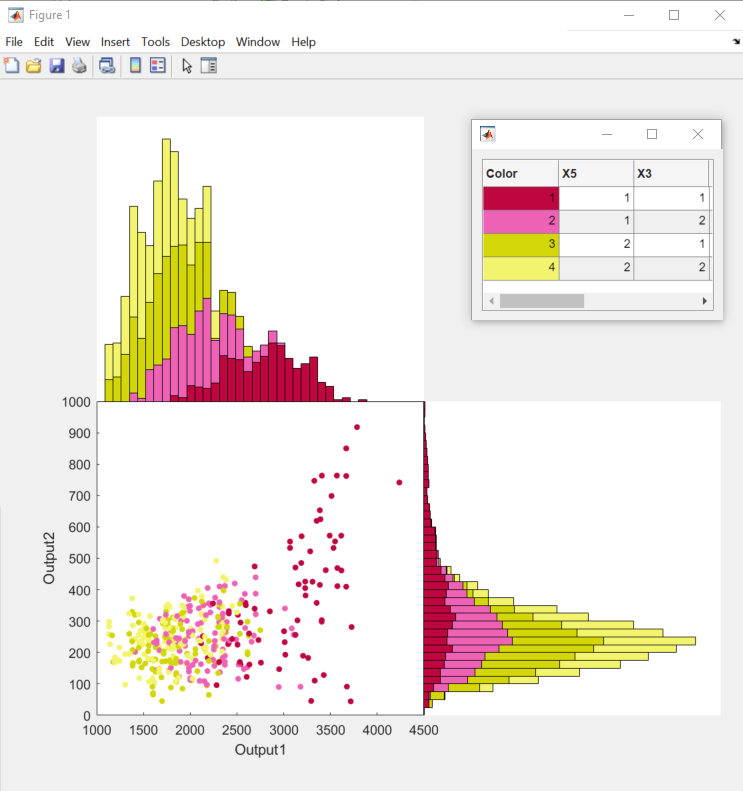
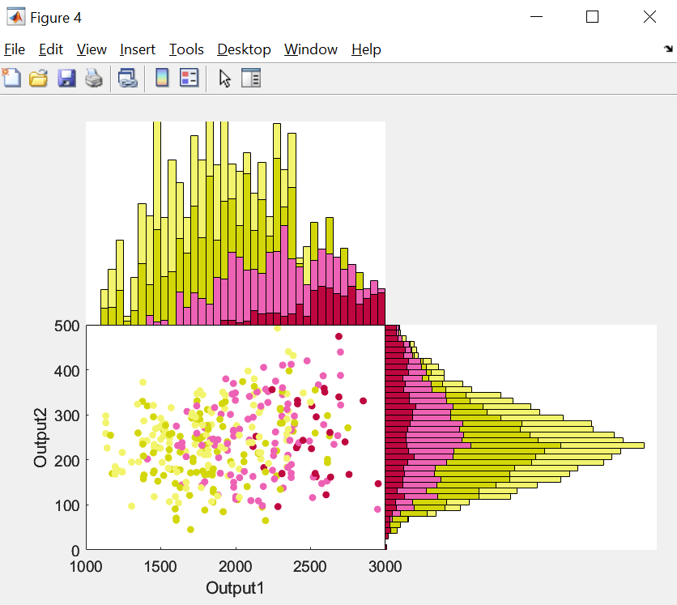
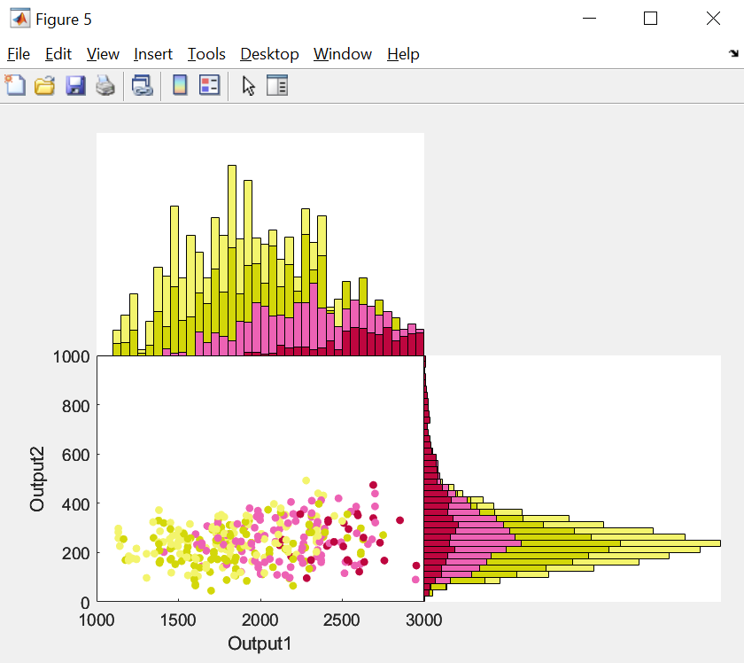

> **Warning**
> This library is under active development and things can change at anytime! Suggestions and help are greatly appreciated.


**Simulation decomposition** or **SimDec** is an uncertainty and sensitivity analysis method, which is based on Monte Carlo simulation. 
SimDec consists of two major parts (and two corresponding funciton):
1. Computing sensitivity indices, 
2. Visualizing the effects by creating multi-variable scenarios, mapping the output values to them, and color-coding the corresponding segments of the output distribution. 

SimDec reveals the nature of causalities and interaction effects in the model.  


## Starting to work
Simply download the matlab [functions](functions) and add them to your path when working with matlab. 

Use [sensitivity_indices.m](sensitivity_indices.m) for computing the indices and [simdec_visualization.m](simdec_visualization.m) for building the graphics.

## Documentation

### function [SI, FOE, SOE]  = [sensitivity_indices](sensitivity_indices.m) (output, inputs)

calculates how much variability of the output is explained by inputs. 

INPUTS
- **output** - target variable (Y), size [N_runs, 1].
- **inputs** - input variables (Xs), size [N_runs, N_factors].

OUTPUTS
- **FOE** - first-order effects (also called 'main' or 'individual'), size [N_factors, 1].
- **SOE** - second-order effects (also called 'interaction'), size [N_factors, N_factors].
- **SI**  - sensitivity indices, combined first- and second-order effect of each input, size [N_factors, 1].  

### function [scenarios, scen_legend, boundaries_out] = [simdec_visualization](simdec_visualization.m) (output, inputs, SI, varargin)

builds SimDec visualization using data decomposition.

REQUIRED INPUTS

- **output** - target variable (Y), size [N_runs, 1].
- **inputs** - input variables (Xs), size [N_runs, N_factors].
- **SI** - sensitivity indices.

OPTIONAL ARGUMENTS

- **DecompositionLimit** - threshold of cumulative importance (sum(SI)) for selection of input variables for decomposition. Default value 0.8*sum(SI). 
- **OrderOfVariables** - for custom decomposition specify the order of variables for decomposition, use zero to exclude. For example, if 4 input variables, third and second are desired for decomposition, then specify OrderOfVariables as [0 2 1 0]. Default value [].
- **NumberOfStates** - the number of states for each input variable, i.e. [0 3 2 0]. Default value [].
- **BoundaryType** - defines how the numerical boundaries between the states of inputs are defined:
  - 'precentile-based' for same amount of observations in each state (default value),   
  -  'interval-based' for equaly-spaced ranges of states.
- **StateBoundaries** - maximums (numeric boundaries) of every state, leave the rest as NaN, e.g. [NaN   3  -1    NaN;    NaN   5   0    NaN;    NaN   7   NaN  NaN]. Default value [].
- **XLim** - Minimum and maximum values for x-axis of the histogram or boxplot [xmin xmax]. 
- **YLim** - Minimum and maximum values for y-axis of the histogram in % values [ymin ymax].  
 - **OutputName** - name of the output variable. Default value 'Y'.
 - **InputNames** - names of the input variables in the order of their appearance in the original dataset. Default value {X1, X2, X3...}.
 - **MainColors** -  a cell array with HEX numbers of the main colors for decomposition (should correspond to the number of states of the first for decomposition input variable). 
 - **GraphType** - 'stacked_histogram' as a default option and 'boxplot' as an alternative.
 - **NumberOfBins** - number of bins for the SimDec histogram.
  - **Output2** - a second output variable, which will be displayed with a scatterhit and decomposition created for the main output variable.
  - **Output2Name** - name for the second output variable, default 'Y2'.
  - **ScatterFraction** - the portion of data / points displayed on the scatterplot. The default value is 1 - the entire dataset is displayed. A value of e.g. 0.5 will show every second point.
  - **XLim2** - Minimum and maximum values for x-axis of the second rotated histogram [xmin xmax]. This scales the scatteplot (ylim) accordingly.
  - **YLim2** - Minimum and maximum values for y-axis of the second rotated histogram in % values [ymin ymax].  


 OUTPUTS
- **scenarios** - an array of the same size as Y with scenario indices for every simulation run.
- **scen_legend** - a scenario table that shows which states of which variables compose different sceanrios.
- **boundaries_out** - numeric boundaries of states of input variables.


## Example
The following procedure is saved in the [main.m](main.m) and uses [example_data.xlsx](example_data.xlsx).

### 1. Load data 
First the simulated `inputs` and the `output` need to be specified. They can result from a Monte Carlo simulation arranged directly in matlab, or conducted elsewhere and then loaded through a file, like in this example. 

```matlab   
    Matrix = xlsread ("example_data.xlsx");
    
    output = Matrix(:,1);
    inputs = Matrix(:,2:end);         
```


### 2. Compute sensitivity indices
Function [sensitivity_indices.m](sensitivity_indices.m) computes first-order effects `FOE` (main individual effect of every input variable), second-order effects `SOE` (interaction effects between pairs of variables) and combined sensitivity indices `SI`. 

```matlab
    [SI, FOE, SOE]  = sensitivity_indices (output, inputs)
    sum(SI) % shows what portion of the variance of the output is explained 
            % by the combined first- and second-order effects of the inputs
```
Here is the result it returns:

SI =

    0.0409
    0.5155
    0.0955
    0.3506

FOE =

    0.0367
    0.4910
    0.1069
    0.2777

SOE =

         0    0.0034    0.0015    0.0035
         0         0   -0.0605    0.1059
         0         0         0    0.0363
         0         0         0         0

sum(SI) = 

    1.0024

Each value shows what portion of the variance of the output is explained (negative SOE values indicate correlation). In this example, SI shows that the most important inputs are X2 (52%) and X4 (35%). SOE points out that there is interaction between X2 and X3 (11%) and correlation between X2 and X3 (-6%). In total, 100% of the output variance is explained (a few percentage points can be attributed to noise).


### 3. Visualize
Function [simdec_visualization.m](simdec_visualization.m) 
1. chooses the most important input variables, 
2. breaks them down into states, 
3. forms scenarios out of all combinations of those states, 
4. maps the scenarios onto the output values, and 
5. visualizes these scenarios by color-coding the distribution of the output.

```matlab
[scenarios, scen_legend, boundaries] = simdec_visualization (output, inputs, SI);
```


The SimDec graph and the corresponding legend is generated automatically when running this function. 


**That's it, your SimDec analysis is completed!**

But you can customize it furhter.

And feel free to go an extra step in your reporting, - name the states (i.e., *low*, *medium*, *high*) and merge the cells of the legend with the same state. The help to make those automatic in would be greatly approeciated! 


### 4. Customize

The [simdec_visualization.m](simdec_visualization.m) function has numerious optional arguments that can be used to polish the outlook of the results, tune and play with the decomposition set-up.

#### 4.1. Boxplot
Add `'GraphType','boxplot'` to the function's input to display the results in the form of boxplot instead of stacked histogram. 

```matlab
    [scenarios, scen_legend, boundaries] = simdec_visualization (output, inputs, SI,'GraphType','boxplot'); 
```


The boxplot visualization presents exactly the same decomposition and contains the same scenarios, color-coded in the same way as in the stacked histogram.

The boxplots are handy when some scenarios have little data and are poorly visible on the histogram. 

#### 4.2. Polishing: colors, names of variables

Use `'OutputName'`, `'InputNames'` to add names of the variables. 
Specify `'MainColors'` as a cell array of HEX codes of the desired main colors (the shades for subdivisions are produced automatically from the main colors). 

```matlab
    output_name = 'Output';
    input_names = {'Input1','Input2','Input3','Input4'};
    colors = {'#3F45D0','#DC267F','26DCD1'}; % HEX codes for the main colors
    
    [scenarios, scen_legend, boundaries] = simdec_visualization (output, inputs,...
        SI,'OutputName',output_name,'InputNames',input_names,'MainColors',colors);
```


#### 4.3. Tuning decomposition: more variables, different state formation

Deafult number of variables for decomposition is defined beased on the threshold `0.8*sum(SI)`. The threshold can be changed by using `'DecompositionLimit'` argument.

The `'BoundaryType'` argument defines how the numeric range of input variables is broken down into states. The deafult value `'percentile-based'` forms the states ensuring the same amount of observations in each state. The alternative `'interval-based'` approach divides input ranges into equaly-spaced intervals. Changing this argument would not make any difference for independent uniformly distributed inputs.


```matlab
    dec_limit = 0.9; % minimum overall importance [sum(SI)] of chosen for decomposition input variables
    boundary_type = 'interval-based'; 
                                   
    [scenarios, scen_legend, boundaries] = simdec_visualization (output, inputs,...
        SI,'DecompositionLimit',dec_limit,'BoundaryType',boundary_type);
```


#### 4.4. Tuning decomposition: more variables, different state formation
The decomposition can be further fully customized by altering the amount and the order of inputs for decomposition (`'OrderOfVariables'`), defining custom amount of states (`'NumberOfStates'`) and their boundaries (`'StateBoundaries'`). 

```matlab
    manual_vars = [0 2 1 0]; % specify the order of variables for decomposition, 
        % use 0 to exclude, size (1, N_inputs). In this example we set that the third
        % input variable is used first, and then the second one.  
    manual_states = [0 3 2 0]; % specify the number of states for each variable, 
        % size (1, N_inputs), the position corresponds to the original order of inputs.
        % Three states for the second input variable and two states for the third. 
    manual_boundaries =  [ NaN    min(inputs(:,2))     min(inputs(:,3))    NaN
                           NaN         100                  657.5          NaN
                           NaN         650             max(inputs(:,3))    NaN      
                           NaN    max(inputs(:,2))          NaN            NaN]; 
        % specify numeric boundaries for every state, size(max(manual_states)+1, N_inputs).


    [scenarios, scen_legend, boundaries] = simdec_visualization (output, inputs,...
        SI,'OrderOfVariables',manual_vars,'NumberOfStates',manual_states,'StateBoundaries',manual_boundaries);
```


The optional attributes can be used in any combination. 


### 5. Two-output scatterhist
If relationship between two output variables is in quesiton, the `simdec_visualization function` can build a scatterplot with two correponding histograms on the top and right side, all decomposed and colored by the logic created for the main output variable. 

To create the scatterhist one needs to specify the second output variable for the argument `'Output2'`, additional optional arguments include `'Output2Name'` and `'ScatterFraction'`, which defines how many dots are shown on the scatterplot (1 - all, 0.5 - every second). Other considered above optional arguments work with scatterhist as well. 


```matlab   
Matrix = xlsread ("example_data2.xlsx");
    
    output = Matrix(:,1);
    output2 = Matrix(:,2);
    inputs = Matrix(:,3:end); 
    
    [SI, FOE, SOE]  = sensitivity_indices (output, inputs) 
    
    outputname = 'Output1';
    output2name = 'Output2';

    share_of_data_shown = 0.005;
    n_bins = 40;

    [scenarios, scen_legend, boundaries] = simdec_visualization (output, inputs, SI,'OutputName',outputname...
    ,'Output2',output2,'Output2Name',output2name,'ScatterFraction',share_of_data_shown,'NumberOfBins',n_bins);
         
```


#### 5.1. Playing with axis limits
You can change x- and y-axes limits for both histograms, the scatterplot scales accordingly. If only the axes of one histogram are changed, the scatterplot and the second histogram scale accordingly. 

```matlab 
    xlim_values = [1000 3000]; % affects x-axis of the top histogram and x-axis of the scatterplot.
    ylim_values = [0 4]; % value in % for Probability y-axis of top histogram, does not affect the scatterplot.
    [scenarios, scen_legend, boundaries] = simdec_visualization (output, inputs, SI,'OutputName',outputname...
        ,'Output2',output2,'Output2Name',output2name,'ScatterFraction',share_of_data_shown,'NumberOfBins',n_bins...
        ,'XLim',xlim_values,'YLim',ylim_values);
```
(The graph demonstrates that not only Output1 axis has been changed as specified in the code above (scatterplot x-axis), but the second histogram has been automatically truncated as well (x-axis of the rotated right histogram and the corresponding y-axis of the scatterplot) to avoid empty space in the scatterplot.)


If the full control over the both axes of the scatterplot is needed, both `'XLim'` and `'XLim2'` should be specified.

```matlab 
    xlim_values = [1000 3000]; % affects x-axis of the top histogram and x-axis of the scatterplot.
    xlim_values_2 = [0 1000]; % affects (rotated) x-axis of the right histogram and y-axis of the scatterplot.
    [scenarios, scen_legend, boundaries] = simdec_visualization (output, inputs, SI,'OutputName',outputname...
        ,'Output2',output2,'Output2Name',output2name,'ScatterFraction',share_of_data_shown,'NumberOfBins',n_bins...
        ,'XLim',xlim_values,'XLim2',xlim_values_2);
```



## Links
- See [how to read SimDec on wikipedia](https://en.wikipedia.org/wiki/SimDec)
- Meet [people behind SimDec](https://www.simdec.fi/team)
- Stay in touch via our [Sensitivity Analysis discord community](https://discord.gg/54SFcNsZS4)


## Citations

The algorithms and visualizations used in this package came primarily out of research at **LUT University**, Lappeenranta, Finland, and **Stanford University**, California, U.S., supported with grants from ***Business Finland***, ***Wihuri Foundation***, ***Foundation for Economic Education***, and ***Natural Sciences and
Engineering Research Council***. If you use SimDec in your research we would appreciate a citation to the following publications:

- Kozlova, M., Moss, R. J., Yeomans, J. S., & Caers, J. (2024). Uncovering Heterogeneous Effects in Computational Models for Sustainable Decision-making. _Environmental Modelling & Software_, 171, 105898. [Available here](https://doi.org/10.1016/j.envsoft.2023.105898)
- Kozlova, M., Moss, R. J., Roy, P., Alam, A., & Yeomans, J. S. (2024). SimDec algorithm and guidelines for its usage and interpretation. In M. Kozlova & J. S. Yeomans (Eds.), _Sensitivity Analysis for Business, Technology, and Policymaking. Made Easy with Simulation Decomposition_. Routledge. [Available here](https://doi.org/10.4324/9781003453789-3).
